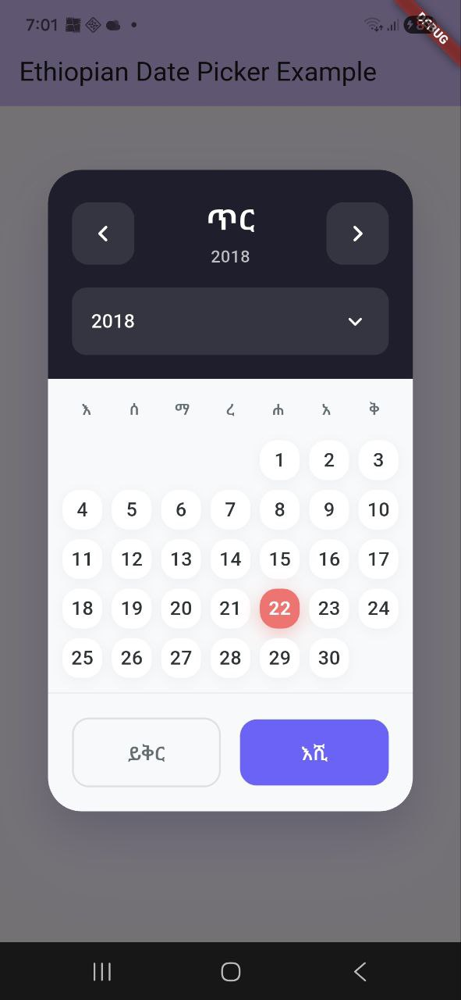
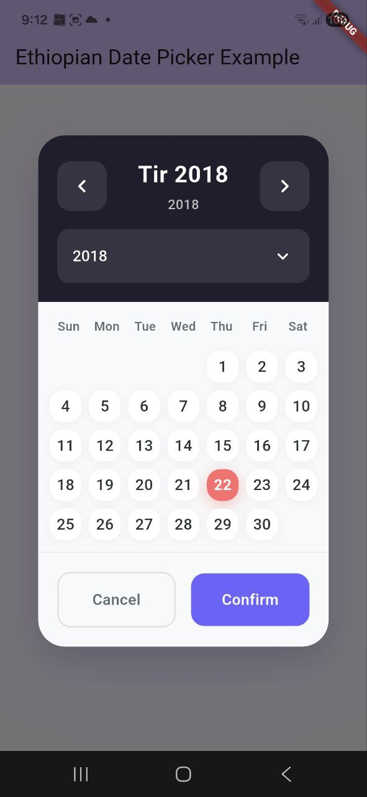
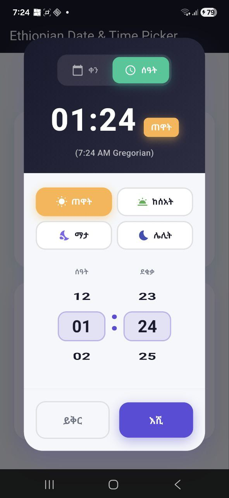

# Ethio Date Picker

A custom Ethiopian date and time picker Flutter package that supports Amharic, English, and Oromo languages. It uses the `abushakir` package for Ethiopian date calculations and `flutter_bloc` for state management.

## Screenshots

### Date Picker

| Amharic | English |
|:---:|:---:|
|  |  |

### DateTime Picker (New in v1.1.0)

| DateTime Picker |
|:---:|
|  |

## Features

### Date Picker (`EthiopianDatePicker`)
- **Ethiopian Calendar Support**: Full support for the Ethiopian calendar year, month, and day.
- **Modern UI**: Clean, solid-color design with animated interactions and shadow depth.
- **Customizable**:
  - `allowPastDates`: Toggle selection of past dates.
  - `todaysDateBackgroundColor`: Customize the accent color for "today".
  - `startYear` & `endYear`: Configurable year range.
- **Null Safety**: Fully supports Dart 3 and null safety.

### DateTime Picker (`EthiopianDateTimePicker`) - New in v1.1.0
- **12-Hour Ethiopian Time**: Traditional Ethiopian time with 4 periods:
  - ☀️ **ጠዋት** (Morning): Ethiopian 12:00-5:59 = Gregorian 6-11 AM
  - 🌤️ **ከሰአት** (Afternoon): Ethiopian 6:00-11:59 = Gregorian 12-5 PM
  - 🌙 **ማታ** (Evening): Ethiopian 12:00-5:59 = Gregorian 6-11 PM
  - 🌃 **ሌሊት** (Night): Ethiopian 6:00-11:59 = Gregorian 12-5 AM
- **Period-Specific Hours**: Hour wheel automatically shows valid hours for selected period.
- **Animated Toggle**: Smooth transitions between date and time selection modes.
- **Gregorian Time Display**: Shows equivalent Gregorian time for reference.

## Getting Started

Add the package to your `pubspec.yaml`:

```yaml
dependencies:
  ethio_date_picker: ^1.1.0
```

Or run:

```bash
flutter pub add ethio_date_picker
```

## Usage

### Date Picker

```dart
import 'package:ethio_date_picker/ethio_date_picker.dart';

void _showDatePicker() async {
  final result = await showDialog<List<String>>(
    context: context,
    builder: (context) => Dialog(
      backgroundColor: Colors.transparent,
      child: EthiopianDatePicker(
        displayGregorianCalender: true,
        userLanguage: 'am', // 'am', 'en', 'ao'
        startYear: 2010,
        endYear: 2025,
        todaysDateBackgroundColor: Colors.blue,
        allowPastDates: true,
      ),
    ),
  );
  
  if (result != null) {
    print("Selected Dates: $result");
  }
}
```

### DateTime Picker (New)

```dart
import 'package:ethio_date_picker/ethio_date_picker.dart';

void _showDateTimePicker() async {
  final result = await showDialog<Map<String, dynamic>>(
    context: context,
    builder: (context) => Dialog(
      backgroundColor: Colors.transparent,
      child: EthiopianDateTimePicker(
        displayGregorianCalender: true,
        userLanguage: 'am', // 'am', 'en', 'ao'
        startYear: 2010,
        endYear: 2025,
        todaysDateBackgroundColor: Colors.blue,
        allowPastDates: true,
      ),
    ),
  );
  
  if (result != null) {
    // Result contains:
    // - date: "15-6-2018" (Ethiopian date)
    // - ethiopianTime: "3:30 ጠዋት"
    // - gregorianTime: "9:30 AM"
    // - hour: 3
    // - minute: 30
    // - period: "morning"
    print("Selected DateTime: $result");
  }
}
```

## Dependencies

- [abushakir](https://pub.dev/packages/abushakir)
- [flutter_bloc](https://pub.dev/packages/flutter_bloc)
- [equatable](https://pub.dev/packages/equatable)

## License

MIT License
