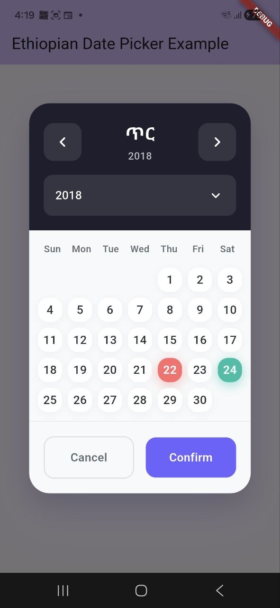

# Ethio Date Picker

A custom Ethiopian date picker Flutter package that supports Amharic, Oromo, and English languages. It uses the `abushakir` package for Ethiopian date calculations and `flutter_bloc` for state management.


## Screenshots

| Light Mode | Dark Mode |
|:---:|:---:|
|  |  |

## Features

- **Ethiopian Calendar Support**: Full support for the Ethiopian calendar year, month, and day.
- **Modern UI**: Clean, solid-color design with animated interactions and shadow depth.
- **Customizable**:
  - `allowPastDates`: Toggle selection of past dates.
  - `todaysDateBackgroundColor`: Customize the accent color for "today".
  - `startYear` & `endYear`: specific configurable year range.
- **Null Safety**: Fully supports Dart 3 and null safety.

## Getting Started

Add the package to your `pubspec.yaml`:

```yaml
dependencies:
  ethio_date_picker: ^1.0.0
```

Or run:

```bash
flutter pub add ethio_date_picker
```

## Usage

```dart
import 'package:ethio_date_picker/ethio_date_picker.dart';

void _showDatePicker() async {
  final result = await showDialog<List<String>>(
    context: context,
    builder: (BuildContext context) {
      return Dialog(
        backgroundColor: Colors.transparent,
        child: ConstrainedBox(
          constraints: const BoxConstraints(maxWidth: 400),
          child: const EthiopianDatePicker(
            displayGregorianCalender: true,
            userLanguage: 'am', // 'am', 'en',
            startYear: 2010,
            endYear: 2020,
            todaysDateBackgroundColor: Colors.blue,
          ),
        ),
      );
    },
  );

  if (result != null) {
    print("Selected Dates: $result");
  }
}
```

## Dependencies

- [abushakir](https://pub.dev/packages/abushakir)
- [flutter_bloc](https://pub.dev/packages/flutter_bloc)
- [equatable](https://pub.dev/packages/equatable)
